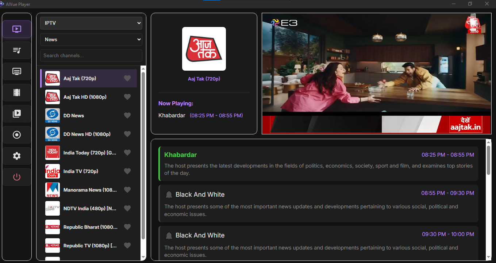
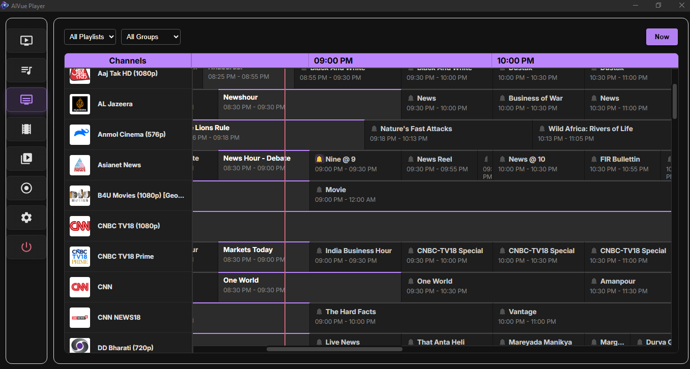
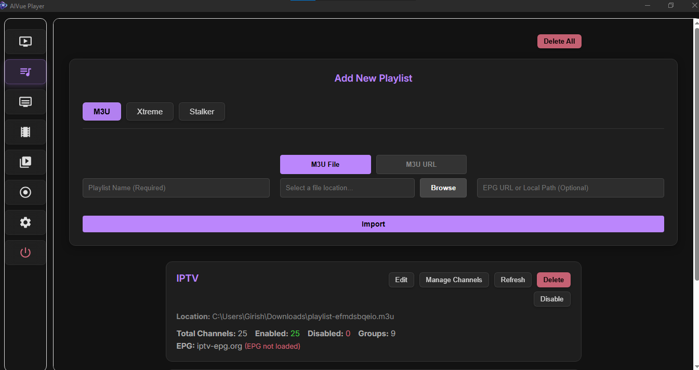
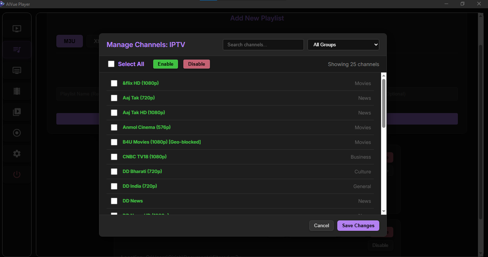
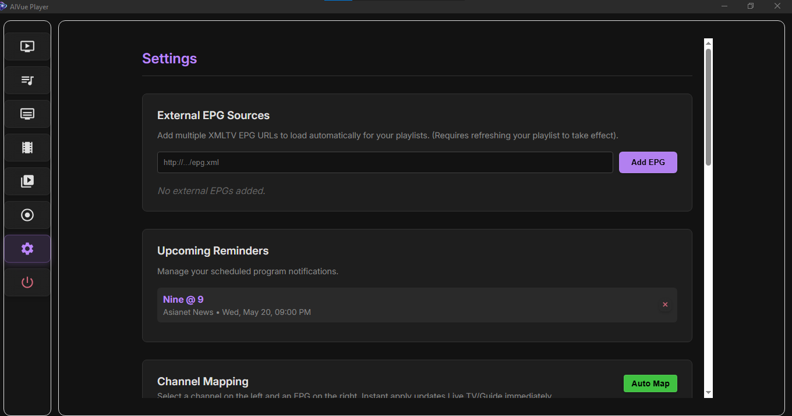
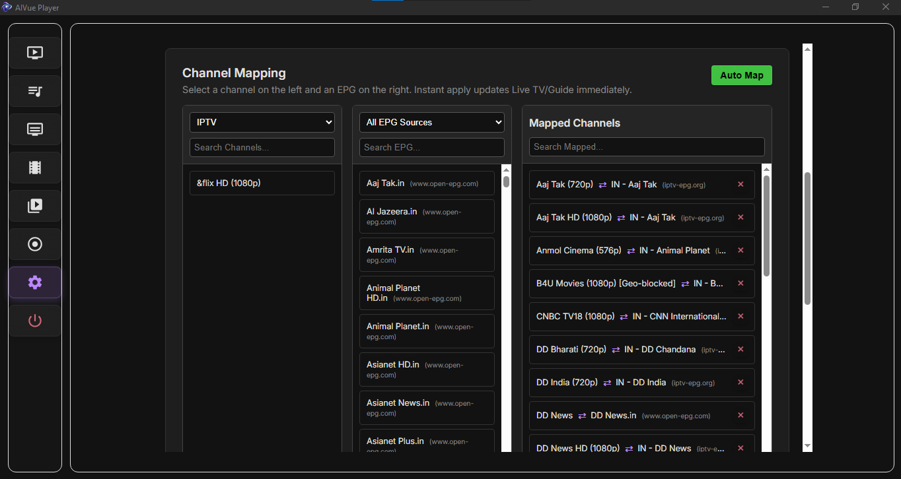
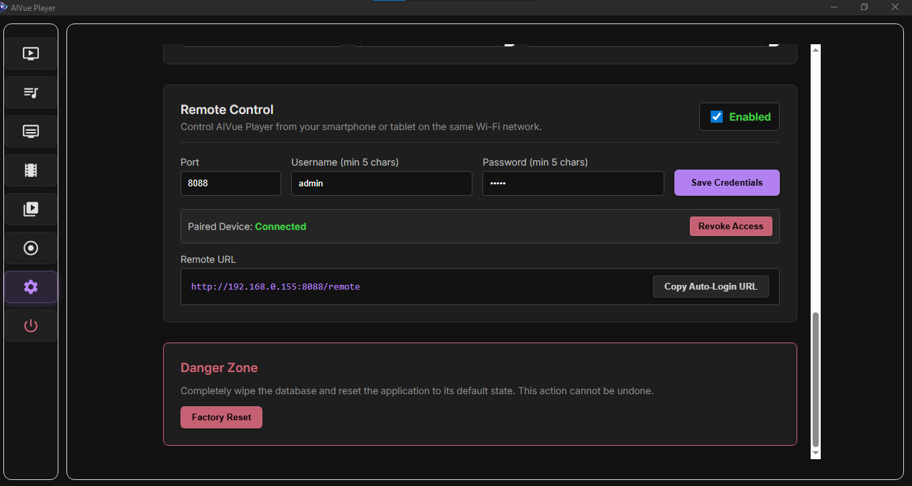
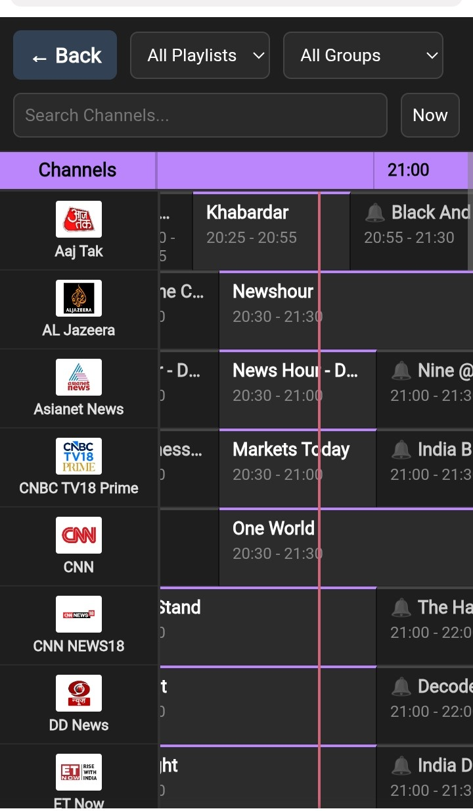
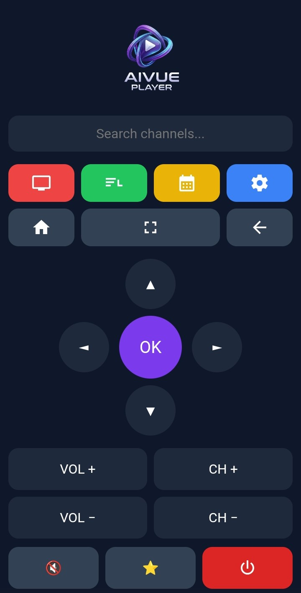

  

<h1 align="center">AIVue Player</h1>

  Modern IPTV Player powered by MPV

  IPTV • EPG • MPV • Mobile Remote

# AIVue Player

Modern IPTV player built with Electron and MPV.

---

## 🚀 Features

- IPTV playlist support (M3U)
- MPV-based playback engine
- Electronic Program Guide (EPG)
- Favorites system
- Channel search and filtering
- Mobile web remote control
- Local API for remote commands
- Fast UI optimized for TV and desktop use

---

## 📸 Screenshots

<table>
<tr>
<td align="center">
<b>Home / Channel List</b> 

</td>

<td align="center">
<b>EPG Guide</b> 

</td>

<td align="center">
<b>Add Playlist</b> 

</td>
</tr>

<tr>
<td align="center">
<b>Manage Channels</b> 

</td>

<td align="center">
<b>Settings</b> 

</td>

<td align="center">
<b>Channel Mapping</b> 

</td>
</tr>

<tr>
<td align="center">
<b>Remote Setup</b> 

</td>

<td align="center">
<b>Mobile Remote</b> 

</td>

<td align="center">
<b>Mobile Search</b> 

</td>
</tr>
</table>
---

## 🛠 Installation

1. Download the installer from Releases
2. Run `AIVue Player Setup.exe`
3. Install and launch the app
4. Load your IPTV playlist (M3U)
5. Start watching

---

## 📡 Remote Control Feature

AIVue supports mobile/web remote control:

- Connect phone and PC on same network
- Pair device using code
- Control playback, navigation, and search
- Send text input directly to search bar

---

## ⚙️ Tech Stack

- Electron
- Node.js
- MPV player
- Express (local API)
- SQLite (for local storage)

---

## 📌 Notes

- Windows only (for now)
- Installer is unsigned (SmartScreen warning may appear)
- Requires network access for IPTV streams
- Contains no M3u links

---

## 🧠 Roadmap

- Xtreme Support
- Stalker Support

---

## 📥 Download

Get the latest release here:

👉 https://github.com/GirishRaj1977/AIVue-Player/releases/latest

---

