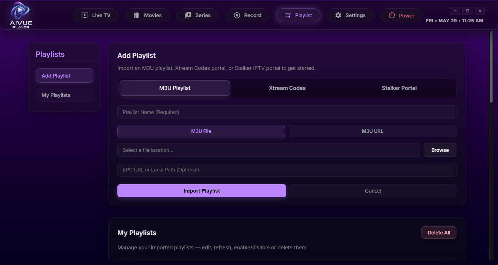
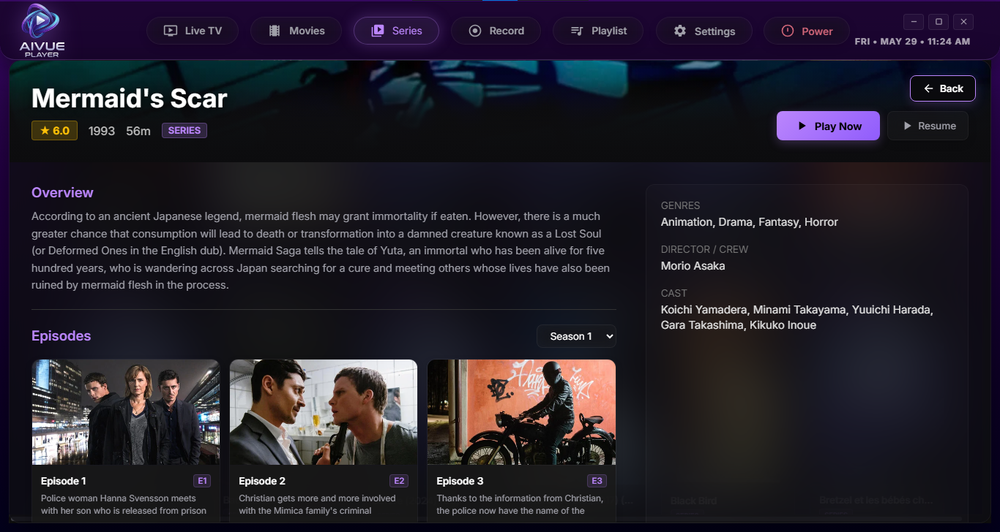

# AIVue Player

<p align="center">
  
</p>

<h3 align="center">AIVue Player</h3>

<p align="center">
  A state-of-the-art, high-performance IPTV & VOD Player built with Electron and powered by a native embedded MPV core, designed with a premium, frosty glassmorphism interface.
</p>

<p align="center">
  
  
  
</p>

---

## ✨ Primary Features

### 📺 Advanced IPTV Playback Engine
* **Embedded MPV Core**: Leverages an ultra-fast, native `mpv.exe` engine embedded inside a frameless Electron window using advanced Win32 OS-level `--wid` handle binding for maximum performance, hardware acceleration (`dxva2`/`d3d11`), and low latency.
* **Format Versatility**: Seamlessly parses and loads massive playlists from standard **M3U**, **Xtream Codes API**, and **Stalker Middleware** portals.
* **Instant Unmute Lifecycle**: Guaranteed audio playback from the millisecond the stream connects by executing automated IPC hardware unmute signals directly into the MPV process on launch.

### 🔮 Premium Frosty UI / UX (Glassmorphism)
* **Custom Dark Theme**: Designed with a high-end, dark-mode purple neon style (`#08080a`) accented by a translucent lavender glow overlay.
* **Draggable Frameless Windows**: Integrated native frameless Electron titlebar layout (`titleBarStyle: 'hidden'`) with an elegant web-drag header region and beautifully unified custom HTML Minimize, Maximize, and Exit buttons matching the glassmorphic aesthetic.
* **Symmetric Navigation Capsule**: Groups all essential categories (Live TV, Movies, Series, Record, Playlist, Settings, and Exit) into a unified, glowing horizontal capsule container positioned neatly in the header area.
* **Dynamic Sidebar Channel Cards**: Sidebar channels (`.channel-item`) rendered as premium frosted glass tiles with smooth scale translations on hover and an active purple glow border.
* **Live Equalizer Badging**: Integrates a real-time, animated CSS audio equalizer indicator next to the channel name when actively playing.

### 📅 Live EPG & Program Grid
* **Live Bottom Grid**: Shows EPG guides directly under the video player. Pinned channels and program cells are styled as frosty glass panels, blending into the theme.
* **Full EPG View**: A dedicated, interactive EPG scheduling grid that lists channel programs chronologically.
* **EPG Tab Return Restorer**: Includes automated viewport boundaries recovery, ensuring EPG grids draw correctly when switching back from other modules.

### 🔴 Intelligent DVR Stream Recording
* **Background Scheduler**: Set one-time or recurring recording sessions for your favorite live streams using advanced cron-like schedule parameters.
* **Conflict & Delta Merging**: Keeps track of scheduled tasks without visual loss, maintaining status hooks safely on update.
* **Delta Toast Notifications**: Real-time confirmation alerts pop up to declare recording startups and teardowns (`Recording Started: "[Program]"`).
* **Precise EPG Recording Isolator**: Isolates active recording flags (`🔴`) exclusively on the currently active EPG cell, leaving future blocks untouched.

### 📥 Minimize to Tray & Resource Optimizer
* **Minimize-to-Tray Lifecycle**: Minimizing or closing the window intercepts default exit calls, cleanly hiding the application into the Windows system tray so background scheduled recordings and services continue executing completely uninterrupted.
* **Smart Background Playback Suspension**: To prevent resource drain, the embedded player automatically shuts down background video/audio streams when minimized or hidden to the system tray.
* **Auto-Resume Recovery**: Automatically tracks your last active channel and instantly resumes stream playback right where you left off as soon as you restore the player from the system tray!
* **Native Desktop Alerts**: Integrates the native Windows HTML5 desktop notification engine to alert you instantly on background recording start, completion, or unexpected failures.

### 🎬 Movies & TV Series VOD Catalog
* **TMDB Automated Metadata Scraper**: Dynamically integrates with **The Movie Database (TMDB) API** to fetch high-fidelity metadata (synopsis, ratings, release year, cast & crew) for imported VOD movies and series.
* **Rich Poster & Fanart Presentation**: Automatically scrapes and renders high-definition backdrops, movie posters, and high-fidelity network logo overlays inside the media details view.
* **Vertical Space Saver Grid**: Category back-navigation moves above the grids in the Movies & Series pages to maximize grid card visibility. Shows a double-row list of titles immediately on load.
* **Smart Back-tracking**: Memorizes active VOD stream information. Stopping a movie or TV show automatically returns you to the active directory modal without resetting your catalog search.

### 📡 Secure Mobile Remote Control
* **Built-in Local API Server**: Spawns an internal Express web server (`PORT 8088`) inside Node.js.
* **QR-Pairing & Authentication**: Pair mobile phones or tablets securely using local network auth tokens.
* **Interactive Web Dashboard**: Stream controls, search bars, volume scrollwheels, playlist navigation, and physical text input redirection straight to the computer screen.

---

## 📸 Screenshots

### 🖥️ Main Player & EPG Scheduling View
<table>
  <tr>
    <td align="center"><b>Live TV Grid & Equalizer</b><br></td>
    <td align="center"><b>Interactive EPG Grid</b><br></td>
    <td align="center"><b>Modern Playlist Importer</b><br></td>
  </tr>
</table>

### 🎬 Movies & TV Series Catalog
<table>
  <tr>
    <td align="center"><b>VOD Main Playlist Folders</b><br></td>
    <td align="center"><b>VOD Search & Grid View</b><br></td>
    <td align="center"><b>Embedded VOD Movie Player</b><br></td>
    <td align="center"><b>TV Series Portal Grids</b><br></td>
  </tr>
</table>

### ⚙️ System Settings Panels
<table>
  <tr>
    <td align="center"><b>Playlist Configuration</b><br></td>
    <td align="center"><b>Remote Server Setup</b><br></td>
    <td align="center"><b>TMDB API Settings</b><br></td>
  </tr>
</table>

### 📡 Local Remote Control Dashboard
<table>
  <tr>
    <td align="center"><b>Mobile Stream Controller</b><br></td>
    <td align="center"><b>Active Device Pairing Prompt</b><br></td>
    <td align="center"><b>Mobile EPG Grid</b><br></td>
    <td align="center"><b>Mobile Keyboard Search</b><br></td>
  </tr>
</table>

---

## 🛠 Tech Stack

* **Frontend**: Vanilla HTML5, High-performance CSS Custom Variables, Javascript (ES6)
* **Backend Shell**: Electron.js, Node.js Core
* **Database**: SQLite (powered by `better-sqlite3` configured under high-speed Write-Ahead Logging `WAL` mode)
* **Video Renderer**: Native `mpv.exe` core connected via Unix Domain Socket / Named Pipe IPC
* **Remote Control API**: Node Express Framework

---

## ⚙️ Installation & Build Setup

### Prerequisites
* Windows OS (7, 10, or 11)
* Node.js (v18+ recommended)
* `npm` or `yarn`

### Setup Codebase
1. Clone the repository:
   ```bash
   git clone https://github.com/GirishRaj1977/AIVue-Player.git
   cd AIVue-Player
   ```

2. Install dependencies:
   ```bash
   npm install
   ```

3. Run in Development Mode:
   ```bash
   npm start
   ```

4. Build Production Installer:
   ```bash
   npm run build
   ```
   *The builder compiles an optimized, unsigned `.exe` setup package inside the `/dist` directory.*

---

## 📡 Remote Control API Integration

The embedded remote API allows direct command pipelines. You can target the player over the local network via `http://<YOUR_PC_IP>:8088/api/command`.

### Example Command Payloads:
* **Play Stream**: `POST /api/command` with JSON `{ "command": "play", "url": "..." }`
* **Stop Playback**: `POST /api/command` with JSON `{ "command": "stop" }`
* **Volume Change**: `POST /api/command` with JSON `{ "command": "volume", "value": 85 }`
* **Navigate UI**: `POST /api/command` with JSON `{ "command": "key", "value": "down" }`

---

## 📥 Download

Grab the latest pre-compiled installer directly from the releases page:

👉 [Download AIVue Player Latest Installer](https://github.com/GirishRaj1977/AIVue-Player/releases/latest)
